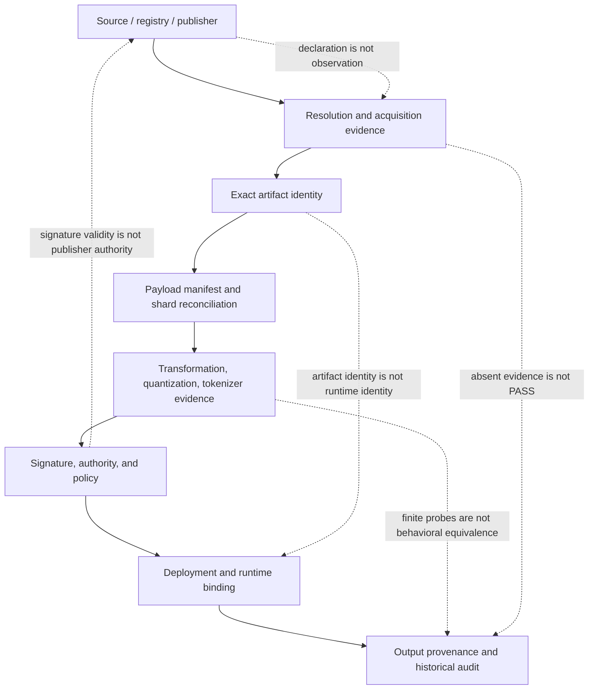

# Open Model Integration Validator (OMIV)

OMIV is an offline-first evidence and verification framework for AI artifacts,
transformations, deployments, and runtime identity.

[](https://github.com/200lz/open-model-integration-validator/actions/workflows/ci.yml)
[](pyproject.toml)
[](LICENSE)
[](docs/roadmap.md)

It preserves the difference between what was declared, what was observed, what
was cryptographically verified, what policy permits, and what remains
unavailable. OMIV is a pre-1.0 framework, not a certification authority, safety
evaluator, authenticity oracle, or production-ready compliance product.

## Why OMIV

A model name is not a model identity. A signature does not prove runtime-loaded
weights. A deployment declaration does not prove which weights produced an output.
Missing evidence remains unavailable. Canonical validity is not authenticity, and
structural parity is not behavioral equivalence.

OMIV gives developers strict schemas, canonical identities and digests,
scope-qualified verification, signatures, policy results, and portable evidence.
It does not turn those records into claims about model safety, provider authority,
complete behavioral equivalence, or runtime weight attribution.

## What OMIV verifies

| Evidence surface | OMIV can verify | OMIV does not establish |
| --- | --- | --- |
| Local artifacts | Declared byte identity, manifests, structure, and canonical digests | Safety, authenticity, or publisher authority |
| Transformations | Supplied lineage, mappings, quantization representation, and bounded numerical evidence | Complete semantic or behavioral equivalence |
| Trust and policy | Signature validity, stated authority, policy evaluation, custody, and historical linkage | That a signer is the rightful publisher or a policy is appropriate |
| Deployment and runtime | Supplied declarations, observations, bindings, and output-provenance records | Which weights actively produced an output without adequate evidence |
| Remote metadata | Bounded supplied snapshots and shard reconciliation | Current provider state or payload identity by default |

An absent, unsupported, or unchecked evidence item never becomes `PASS`.

## 30-second quickstart

From a clean clone, install OMIV from source. Dependency installation may contact
a package index; the verification command itself is offline.

```bash
python -m venv .venv
source .venv/bin/activate
python -m pip install -e .
omiv --version
omiv runtime-resolution verify runtime-resolution-parity/scenarios/immutable-pinned.json
```

Expected verification output and exit status:

```text
0.10.0
VALID_CANONICAL_RUNTIME_RESOLUTION_OBJECT schema=omiv.runtime-resolution-scenario-result.v1
exit code: 0
```

The tracked input is synthetic demonstration data. This command establishes only
strict parsing, supported-schema recognition, and canonical identity/digest
relationships for that supplied object. It makes no provider request, resolves no
live alias, observes no deployment or runtime-loaded weights, and runs no inference.
It does not establish provider authenticity, publisher authority, safety, or
production readiness. See the [complete quickstart](docs/quickstart.md) and [offline
demonstration](examples/offline-quickstart/README.md), including PowerShell activation
and exit-code semantics.

## Evidence chain



The arrows describe possible evidence flow, not universal automation. Read the
[architecture overview](docs/architecture.md) for component boundaries and the
current Phase 5/6 evidence model.

## Current capabilities

| Area | Available now | Bounded, local, or offline scope | Explicit non-goals |
| --- | --- | --- | --- |
| Phase 5 | Passports, custody, attestations, trust, governance, security, runtime continuity, and historical audit | Verification of supplied evidence and policy-scoped results | Safety certification, real-world truth, or automatic approval |
| Phase 6A | Payload manifests and exact local byte identity | Local files and declared expectation scope | Publisher identity or safety |
| Phase 6B | Remote metadata and shard reconciliation | Supplied/pinned metadata; collectors are separate and opt-in | Payload download or inferred weight identity |
| Phase 6C | Quantization representation and bounded numerical-fidelity evidence | Declared samples, limits, and Decimal semantics | Whole-model behavioral equivalence |
| Phase 6D | Tokenizer/configuration structural parity and supplied probes | Supplied local artifacts and finite probes | Complete tokenizer or behavioral equivalence |
| Phase 6E | Mutable resolution, deployment binding, supplied backend results, and output-provenance schemas | Offline verification of supplied records | Live resolution, inference, or provable inference |

The [documentation index](docs/README.md) links the design and implementation
documents for every released engineering phase. Phase 6F Assurance Bundle
interoperability is planned and is not implemented.

### How to read an OMIV result

OMIV results are deliberately narrower than labels such as “verified model.” Read
each result through five questions:

1. **What is the subject?** A file, logical model, transformation, deployment,
   runtime observation, request, and output are different subjects.
2. **What is the scope?** A selected member set, local directory, finite probe set,
   policy profile, environment, and historical cutoff limit what was evaluated.
3. **What evidence was supplied?** A declaration, direct observation, digest-only
   reference, signature, and provider document carry different authority.
4. **What was reconstructed?** Schema validity, canonical digest identity, reference
   linkage, signature validity, and policy evaluation are separate checks.
5. **What remains unavailable?** Limitations and missing evidence are part of the
   result, not footnotes to discard.

For example, an intact signature can show that bytes were signed by a particular
key. A separate trust record is needed to state what that key is authorized to sign,
and neither record alone shows that the signed artifact was loaded by a runtime.
Likewise, an exact finite probe result applies only to the declared probes and does
not establish identical weights or behavior outside that set.

### Evidence result vocabulary

Different OMIV subsystems use typed, domain-specific outcomes, but the following
reading rules are consistent:

| Result shape | Interpretation |
| --- | --- |
| Valid canonical object | Strict parsing and identity reconstruction succeeded for the supplied object |
| Exact match for declared scope | All requirements inside an explicit finite scope matched |
| Valid with limitations | Integrity succeeded while named evidence or scope remains incomplete |
| Not available / not checked | Required evidence was not supplied or was intentionally outside the operation |
| Policy nonpassing | The supplied evidence did not satisfy the selected policy; this is not necessarily malformed input |
| Integrity invalid | Schema, digest, reference, signature, or canonical reconstruction failed |

Always keep the subject, scope, evidence source, policy identity, and limitations
beside the headline outcome. Portable evidence is designed to preserve those
qualifiers when it moves between tools or organizations.

### Verification posture

OMIV defaults to offline verification. Network-capable collection is a separate,
explicit operation with its own bounds; verification never fills gaps by contacting
a provider. Canonical output avoids host-specific paths, clock-dependent identities,
and accidental mutation of tracked evidence.

This posture makes results reviewable in a clean checkout and usable in air-gapped
or controlled environments after installation. It also keeps collection authority
separate from verification authority: the verifier can check a portable supplied
record without claiming to have witnessed how it was collected.

When integrating OMIV into automation, treat nonzero scope/policy outcomes,
integrity errors, missing external artifacts, and unsupported evidence as distinct
states. Do not flatten them into a generic success or failure that loses why the
result was bounded.

### Common offline workflows

The root quickstart exercises one safe verification path. The
[offline evidence walkthrough](docs/offline-evidence-walkthrough.md) continues
through tracked Phase 5 and Phase 6A–6E evidence, including expected semantic
exit-`1` results and a temporary malformed-input exit-`2` demonstration. The
repository also contains bounded offline interfaces for:

- validating canonical inventory structure;
- comparing GGUF inventories under explicit policies;
- validating semantic mappings and transformation lineage;
- verifying Model Passport and custody integrity;
- checking signed attestations, trust bundles, and revocation records;
- evaluating governance, security, and historical trust evidence;
- verifying local payload manifests and declared expectations;
- reconstructing remote metadata and shard-reconciliation objects;
- inspecting quantization and tokenizer/configuration evidence;
- verifying supplied deployment, runtime, and output-provenance records.

These commands do not all have the same exit-code policy. Consult the linked phase
document and command help before automating a gate:

```bash
omiv --help
omiv runtime-resolution verify --help
```

Collectors and conversion runners are distinct from offline verification. Some are
explicitly opt-in or can execute external tools; they are not part of the quickstart
and should be reviewed under their own documented threat and resource boundaries.

### Repository evidence versus external artifacts

Tracked synthetic and canonical examples make verifier behavior reviewable without
large payloads. They do not pretend to be fresh provider observations. When a
referenced external artifact is absent, OMIV either reports that absence or offers a
clearly named reduced-scope verification mode where the schema supports one.

In particular, the ignored Kimi raw inventory is not a quickstart dependency. Do not
create or download it to run the demonstration. Remote practice collectors are also
unnecessary for normal offline verification and are never invoked implicitly.

## Real-world case studies

- **Case Study 01 — Unsloth Gemma 4 E2B IT Q8_0 GGUF:** The export succeeded, and
  both current artifact identities matched retained historical C1 size/SHA-256
  observations. OMIV also made
  source-provenance and main/mmproj companion-binding observability gaps explicit.
  Read the [case study](case-studies/unsloth-gemma4-e2b-it-q8/README.md) with its
  methodology, claim registry, evidence index, results, and limitations.

## Practice-profile limitations

Practice profiles illustrate bounded evidence contracts; they are not endorsements,
partnerships, or claims about current provider state.

| Profile | Current scope | Important limitation |
| --- | --- | --- |
| Qwen | Existing local model-pack and format examples | Example coverage does not make a universal integration claim |
| Kimi | Structural and reference evidence | The large raw local inventory is not distributed |
| xAI | Bounded public metadata and documented mutable-alias/roadmap evidence | No observed runtime weight identity |
| DeepSeek | Readiness and missing-snapshot contract | Readiness is not a completed integration |
| Hugging Face | Provider-neutral bounded metadata interface | No default network use and no provider endorsement |

## Public and future commercial boundary

The open core owns canonical schemas, canonicalization, evidence semantics,
signatures and verification, the offline CLI, portable evidence, policy-result
semantics, and future public Assurance Bundle verification.

Possible future commercial operation may add managed collection, private
registries, continuous monitoring, organization-wide policy operation, RBAC/SSO,
KMS/HSM integration, deployment admission, managed history, connectors, and
support. No such product or repository is claimed here, and it may not secretly
redefine canonical public OMIV semantics. Read the
[full boundary](docs/public-commercial-boundary.md).

## Documentation

Start with the [documentation index](docs/README.md):

- [Quickstart](docs/quickstart.md)
- [Offline evidence walkthrough](docs/offline-evidence-walkthrough.md)
- [Architecture](docs/architecture.md)
- [Technical reference migrated from the historical README](docs/reference/technical-reference.md)
- [README migration map](docs/reference/readme-migration-map.md)
- [Security and privacy](docs/public-release-security-and-privacy.md)
- [GitHub publication controls](docs/github-publication-controls.md)
- [R1F final-publication audit](docs/r1f-final-publication-audit.md)
- [v0.10.0 release notes](docs/v0.10.0-release-notes.md)
- [v0.10.0 publication recovery](docs/v0.10.0-publication-recovery.md)
- [Roadmap](docs/roadmap.md)

## Project status and roadmap

OMIV is public and publicly available as a pre-1.0 Alpha public preview. The repository is public.
The signed annotated `v0.10.0` tag and its GitHub pre-release exist, while
the PyPI project and version remain absent after the first Trusted Publishing workflow
failed before its publish job. Engineering Phases 5 and 6A–6E are released in repository history;
Phase 6F is planned and not implemented. Public
availability is not release completion and does not establish production readiness,
certification, safety, provider authenticity, or publisher authority. See the
[roadmap](docs/roadmap.md), [release notes](docs/v0.10.0-release-notes.md), and
[changelog](CHANGELOG.md).

## Contributing, security, support, and license

Contributions follow [CONTRIBUTING.md](CONTRIBUTING.md) and
[GOVERNANCE.md](GOVERNANCE.md). Report vulnerabilities through
[SECURITY.md](SECURITY.md), and use [SUPPORT.md](SUPPORT.md) for support scope.

OMIV is licensed under [Apache-2.0](LICENSE); see [NOTICE](NOTICE) and
[third-party notices](THIRD_PARTY_NOTICES.md). Project and provider names remain
subject to [trademark guidance](TRADEMARKS.md). OMIV is independent and is not an
official, approved, endorsed, or affiliated tool of any model provider.
