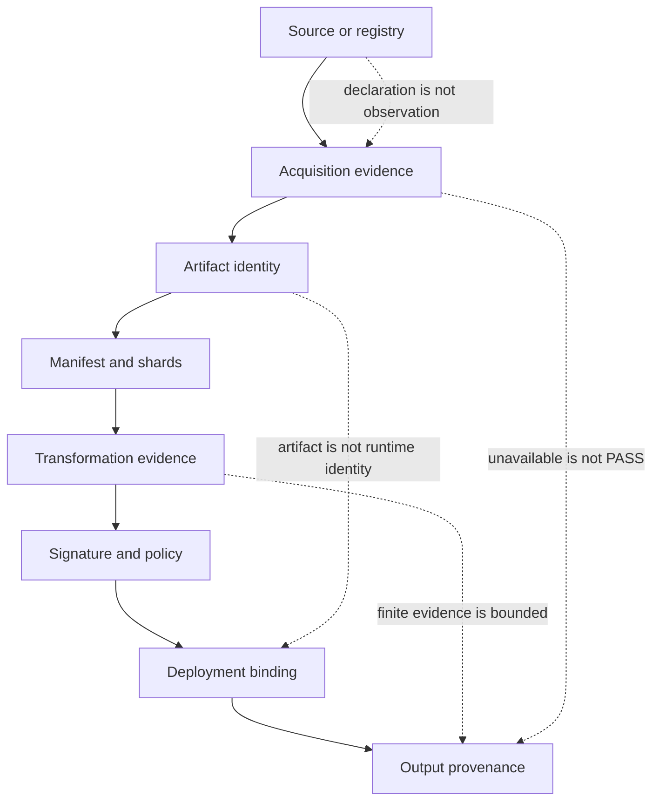

# Open Model Integration Validator (OMIV)

OMIV is an offline-first framework
for verifying AI model artifacts,
transformations, deployments,
and runtime identity.

[](https://github.com/200lz/open-model-integration-validator/actions/workflows/ci.yml)
[](pyproject.toml)
[](LICENSE)
[](docs/roadmap.md)

Know what model artifact you have, what changed, what evidence supports it,
and what remains unknown.

It is for model release teams,
inference/runtime maintainers,
conversion and quantization vendors,
chip and platform teams,
and enterprise AI teams.

It verifies bounded evidence for artifacts,
shards, GGUF comparisons, transformations,
configuration, trust, policy,
and runtime records.

Try the offline quickstart below, then see the real
[Unsloth Gemma 4 case study](case-studies/unsloth-gemma4-e2b-it-q8/README.md).

OMIV is a pre-1.0 Alpha public preview,
not a certification authority, safety evaluator,
authenticity oracle,
or production compliance product.

## Why OMIV

A model name is not a model identity.
A signature does not prove which weights
a runtime loaded or produced an output.

OMIV separates declarations, observations,
cryptographic verification, policy decisions,
and unavailable evidence.
Missing evidence stays unavailable.

Canonical validity is not authenticity.
Structural parity is not behavioral equivalence.
OMIV does not diagnose or fix
every integration problem.

## What OMIV verifies

| Evidence surface | Verifiable within scope | Not established |
| --- | --- | --- |
| Artifacts | Bytes, manifests, structure, digests | Safety or publisher authority |
| Shards/GGUF | Completeness and structural comparison | Universal compatibility |
| Changes | Lineage, mappings, representation, samples | Complete semantic equivalence |
| Trust | Signatures, authority, custody, policy | Policy appropriateness |
| Runtime | Supplied resolution, deployment, output bindings | Active weights without evidence |

An absent, unsupported, or unchecked item never becomes `PASS`.

## 30-second quickstart

From a clean clone, install from source. Installation may contact a package
index; the verification command itself is offline.

```bash
python -m venv .venv
source .venv/bin/activate
python -m pip install -e .
omiv --version
omiv runtime-resolution verify runtime-resolution-parity/scenarios/immutable-pinned.json
```

Expected output and exit status:

```text
0.10.0
VALID_CANONICAL_RUNTIME_RESOLUTION_OBJECT schema=omiv.runtime-resolution-scenario-result.v1
exit code: 0
```

The input is synthetic.
The command verifies parsing, schema support,
and identity/digest relationships for that object.
It makes no provider request,
resolves no live alias,
observes no deployment or loaded weights,
and runs no inference.

See the [complete quickstart](docs/quickstart.md)
and [offline demonstration](examples/offline-quickstart/README.md).

## Evidence chain



This is possible evidence flow, not universal automation. See
[architecture](docs/architecture.md).

## Current capabilities

OMIV currently covers:

- artifact identity and manifests;
- shard completeness and reconciliation;
- GGUF/source-to-target comparison;
- transformation and quantization evidence;
- tokenizer/configuration evidence;
- signatures, trust, and policy;
- deployment, runtime, and output provenance.

Released boundaries remain narrow:

| Phase | Released scope | Boundary |
| --- | --- | --- |
| Phase 5 | Passports, custody, attestations, trust, governance, security, runtime continuity, historical audit | Supplied evidence; no automatic approval |
| Phase 6A | Local manifests and byte identity | No publisher or semantic claim |
| Phase 6B | Pinned metadata and shard reconciliation | Collection stays separate |
| Phase 6C | Representation and bounded numerical-fidelity evidence | Declared samples and limits only |
| Phase 6D | Tokenizer/configuration parity and supplied probes | Finite scope only |
| Phase 6E | Runtime resolution, deployment binding, supplied results, output provenance | No implicit live inference |

Phase 6F remains Assurance Bundle interoperability. Its engineering scope now
provides local preflight, conservative concise verdicts, fixed portable core
documents, deterministic `.omiv` transport, Phase 5/6A–6E schema interoperability,
detached signatures with external trust policy, and offline fail-closed verification.
No Phase 6F release is claimed. Phase 7 scope remains unfrozen.
An isolated [Phase 7A candidate](docs/phase-7a-smart-preflight.md) can now discover
bounded local canonical evidence and generate a Phase 6F request; it does not freeze
Phase 7 scope or bypass the Assurance Bundle preflight.
An isolated [Phase 7B candidate](docs/phase-7b-runtime-compatibility-profiles.md) adds
an explicitly supplied, bounded local runtime profile and five-stage evidence path.
The Phase 7B.1 hardening invokes the native CLI directly, embeds its canonical plan,
and keeps runtime internals `UNKNOWN` when raw output cannot establish them. Its
tracked workflow is synthetic, CPU-only, and offline; it does not freeze Phase 7
scope or claim general runtime compatibility. The Phase 7B.2 candidate adds a
manifest-bound offline import/verify path for the explicit
`llama.cpp-cuda-capture.v1` collector grammar; captured runner claims remain
untrusted, artifact reports do not verify payload bytes, and incomplete captures
cannot establish process PASS. Process completion and output predicates are reported
separately: a matched text or fixed PNG predicate is `OBSERVED`, never `PASS`. Its
privacy screen covers a bounded set of established path and credential signatures; it
is not exhaustive secret detection or DLP, so callers must sanitize capture inputs and
use a secret-free evidence directory.
See the [roadmap](docs/roadmap.md).

### Reading results

Keep subject, scope, source, policy,
and limits together. Unavailable stays unavailable.
Signatures do not prove authority or runtime use.

### Offline and fail-closed posture

Verification defaults to offline operation. Collection is explicit and separate;
verification does not contact providers to fill gaps.

Missing evidence, unsupported schemas, integrity errors,
and policy failures remain distinct.

The [offline walkthrough](docs/offline-evidence-walkthrough.md) covers tracked
Phase 5 and Phase 6A–6E records and exit-code semantics.

Collectors and conversion runners may execute tools or access networks.
They are outside the quickstart.

## Real-world case study

**Case Study 01 — Unsloth Gemma 4 E2B IT Q8_0 GGUF**
is an independent, offline structural
and provenance-observability analysis.

The export succeeded.
Current main-GGUF and mmproj sizes/SHA-256 values
match retained historical C1 observations.
Source-revision and format-native companion binding
remained unavailable.

The historical C1 bytes are unavailable,
so this is `HISTORICAL_C1_MATCH`,
not a new direct C1/C2 file comparison.

The study makes no semantic-fidelity,
numerical-fidelity, or runtime-compatibility claim.
Structural validation is not behavioral equivalence.

We warmly thank Daniel Han
for suggesting Gemma 4 E2B IT
and the opportunity to test a real Unsloth export.
OMIV worked independently;
the exchange does not imply partnership, endorsement,
approval, certification, or joint work.

Read the
[case study](case-studies/unsloth-gemma4-e2b-it-q8/README.md)
with its claims, evidence, results, and limits.

## Practice-profile limitations

Practice profiles are bounded examples,
not partnerships, endorsements,
or claims about current provider state.
See the [technical reference](docs/reference/technical-reference.md).

## Public and future commercial boundary

The public open core owns schemas,
canonicalization, evidence semantics,
signatures, offline verification,
portable evidence, policy results,
and public Assurance Bundle verification.

Possible future commercial work may add
managed collection, private registries,
monitoring, organization policy,
RBAC/SSO, KMS/HSM, deployment admission,
connectors, history, and support.

No commercial product is claimed. Future services may not redefine public OMIV
semantics. See the [full boundary](docs/public-commercial-boundary.md).

## Documentation

Start with the [documentation index](docs/README.md).

- [Quickstart](docs/quickstart.md)
- [Offline evidence walkthrough](docs/offline-evidence-walkthrough.md)
- [Architecture](docs/architecture.md)
- [Security and privacy](docs/public-release-security-and-privacy.md)
- [GitHub publication controls](docs/github-publication-controls.md)
- [R1F publication audit](docs/r1f-final-publication-audit.md)
- [Release notes](docs/v0.10.0-release-notes.md)
- [Roadmap](docs/roadmap.md)
- [Phase 6F Assurance Bundles](docs/phase-6f-assurance-bundle-interoperability.md)
- [Phase 7B Runtime Compatibility Profiles](docs/phase-7b-runtime-compatibility-profiles.md)

Detailed command and phase guidance lives in the documentation.

## Project status and roadmap

The repository is public. OMIV remains a pre-1.0 Alpha public preview,
not a production, certification, safety, or authenticity claim.

Phases 5 and 6A–6E are released in history. The Phase 6F engineering scope is
complete on current main but is not released.
Phase 7 scope is not frozen. The signed annotated `v0.10.0` tag and GitHub pre-release exist;
the PyPI project/version remain absent after a pre-publish failure.

Public availability is not release completion. See the [roadmap](docs/roadmap.md)
and [release notes](docs/v0.10.0-release-notes.md).

## Contributing, security, support, and license

Contributions follow [CONTRIBUTING.md](CONTRIBUTING.md) and
[GOVERNANCE.md](GOVERNANCE.md).

Report vulnerabilities through [SECURITY.md](SECURITY.md). Use
[SUPPORT.md](SUPPORT.md) for the support boundary.

OMIV uses [Apache-2.0](LICENSE). See [NOTICE](NOTICE),
[third-party notices](THIRD_PARTY_NOTICES.md),
and [trademarks](TRADEMARKS.md).

OMIV is independent and is not an official, approved, endorsed, affiliated, or
certified tool of any model provider.
